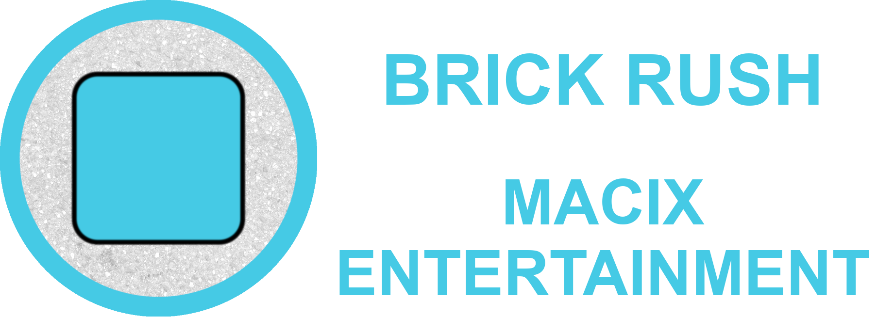
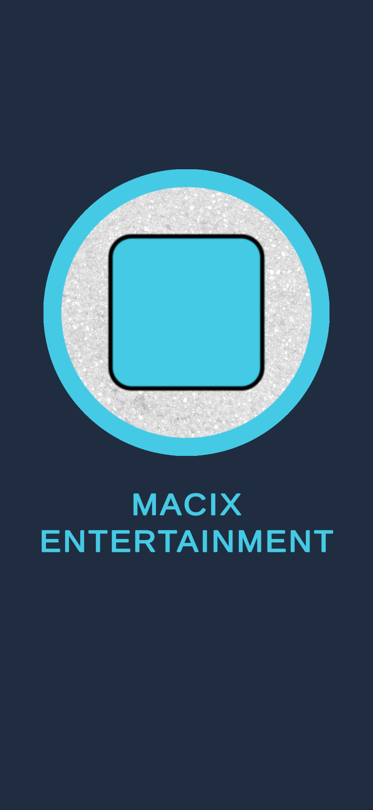
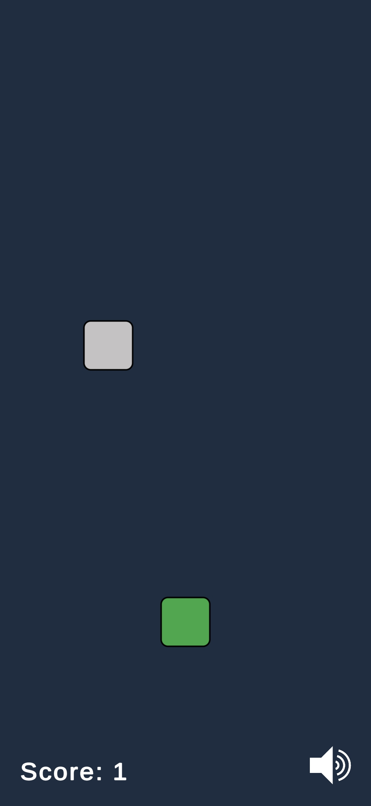
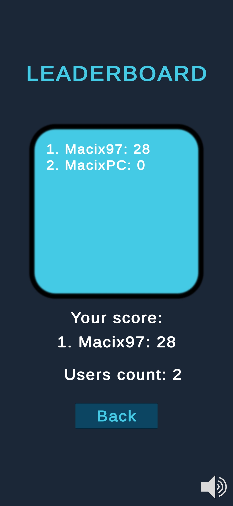

## Important links
* [Release](https://github.com/Macix97/brick-rush/releases)
* [License](https://github.com/Macix97/brick-rush/blob/main/LICENSE.txt)
* [Documentation](https://github.com/Macix97/brick-rush/tree/main/Docs/BrickRushV1.0.pdf)

## Abstract

Brick Rush is simple mobile arcade game. The goal of the game is to stop as many falling bricks as possible. Each accurate action guarantees extra point.

## Features

The list below presents most important properties:
* Endless progressive game stages.
* Personal account assigned to the user device.
* Global networked leaderboard.

## Game visualization

### The pictures below show the most important aspects of the program:

## Used technologies

The list of used solutions:
* Unity 2022.3.16f1 - Efficient and expanded game engine.
* Visual Studio Code 1.88.1 - Primary, lightweight IDE.
* GIMP 2.10 - Open source image editor.

## Credits

The author of the project have using some arts shared by CC0 or CC BY license. Without this support, the game would not be possible. A complete list of the used materials and their creators can be found in the credits text file. Moreover, many free resources from the unity asset store were included.